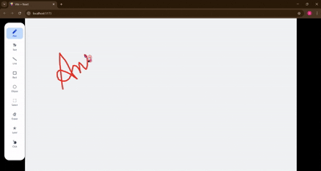

# 🖍️ Whiteboard App

A **simple whiteboard** built using **React.js**, **Tailwind CSS**, and the **ZegoCloud Superboard SDK** — designed for quick and smooth sketching on a personal canvas. No user login or collaboration required.

---

## 🧠 How It Works

This app initializes a whiteboard using the ZegoCloud SDK inside a React component. With a pre-generated token, it loads a local whiteboard where you can:

- Draw freehand 🖊️  
- Insert shapes ▭ ⭕  
- Add text ✍️  
- Use eraser 🧽  
- Highlight with laser ✨  

All of this is done **without any real-time collaboration** — the board is meant for single-user, standalone use.

---

## ✨ Features

- 🎨 Multiple tools: Pen, Eraser, Text, Shapes, Laser
- ⚡ Fast & responsive canvas
- 🎯 Tooltips with icons
- 💡 Tailwind-powered UI

---

## 📦 Tech Stack

- **React.js** – Frontend framework
- **Tailwind CSS** – Styling
- **ZegoCloud SDK** – Renders the whiteboard locally (non-collaborative)

---

